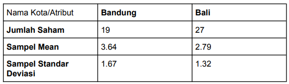

<p align="center">
  <a href="" rel="noopener">
 </a>
</p>

<h3 align="center">
  Praktikum 2 Probstat B
</h3>

---

<p align="center">
  Achmad Ferdiansyah
    <br/>
    5025201245 
</p>

## Daftar Soal

- [1](#1)
- [2](#2)
- [3](#3)
- [4](#4)
- [5](#5)

## No. 1 <a name = "1"></a>

<p>
Seorang peneliti melakukan penelitian mengenai pengaruh aktivitas 𝐴 terhadap
kadar saturasi oksigen pada manusia. Peneliti tersebut mengambil sampel
sebanyak 9 responden. Pertama, sebelum melakukan aktivitas 𝐴, peneliti mencatat
kadar saturasi oksigen dari 9 responden tersebut. Kemudian, 9 responden tersebut
diminta melakukan aktivitas 𝐴. Setelah 15 menit, peneliti tersebut mencatat kembali
kadar saturasi oksigen dari 9 responden tersebut. Berikut data dari 9 responden
mengenai kadar saturasi oksigen sebelum dan sesudah melakukan aktivitas 𝐴
</p>

<p>
Berdasarkan data pada tabel diatas, diketahui kadar saturasi oksigen dari
responden ke-3 ketika belum melakukan aktivitas 𝐴 sebanyak 67, dan setelah
melakukan aktivitas 𝐴 sebanyak 70.
</p>

- a.) Carilah Standar Deviasi dari data selisih pasangan pengamatan tabel
diatas
```
#no. 1
org.ke = c(seq(1:9))
oksigen.bfr = c(78, 75, 67, 77, 70, 72, 78, 74, 77)
oksigen.aft = c(100, 95, 70, 90, 90, 90, 89, 90, 100)
data = data.frame(org.ke,oksigen.sblm, oksigen.aft)
n = 9

#a
selisih = data$oksigen.aft - data$oksigen.bfr
cat("Standar deviasi selisih pasangan pengamatan : ")
standardev = sd(selisih)
standardev

# standardev = 6.359595
```
- b.)  carilah nilai t (p-value) Untuk mencari nilai t (p-value) dapat menggunakan fungsi t.test yaitu sebagai berikut
```

#b
miu = 0
xbar = mean(selisih)
tstastistik =( (xbar - miu) / (standardev / sqrt(n)))
pvalue = 2 * pt(-abs(tstastistik), df=n-1)
pvalue
```
- c.)  Tentukanlah Apakah Terdapat Pengaruh yang Signifikan Secara Statistika dalam Hal Kadar Saturasi Oksigen, Sebelum dan Sesudah Melakukan Aktivitas 𝐴 jika Diketahui Tingkat Signifikansi 𝛼 = 5% serta H0 : “tidak ada pengaruh yang signifikan secara statistika dalam hal kadar saturasi oksigen , sebelum dan sesudah melakukan aktivitas 𝐴”
```
#c

t.test(x=data$oksigen.aft, y=data$oksigen.bfr,
       alternative = "two.sided",
       miu = 0, paired = TRUE, var.equal = TRUE,
       conf.level = 0.95)

```


## No. 3


<p>
Dari data diatas berilah keputusan sertakesimpulan yang didapatkan dari hasil
diatas. Asumsikan nilai variancenya sama, apakah ada perbedaan pada
rata-ratanya (α= 0.05)? Buatlah :
</p>

- a.) Ho dan H1
<t/><p>
  H0: &#956;1 = &#956;2
  <br/>
  H1: &#956;1 &#8800; &#956;2 
</p>

- b.) Hitung Sampel Statistik
<t/><p>
  
</p>


